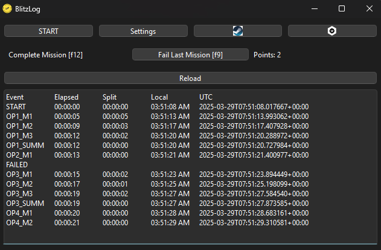
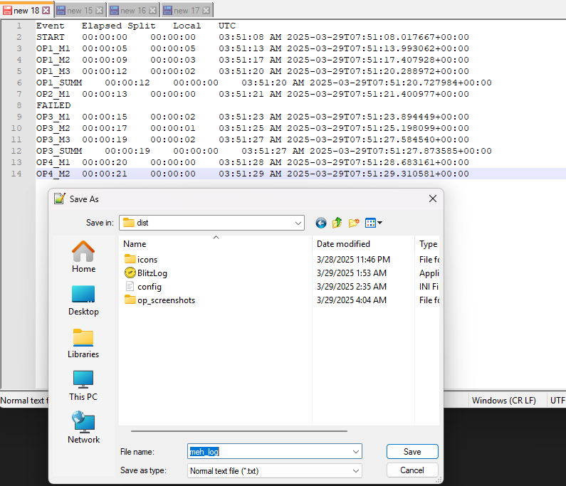
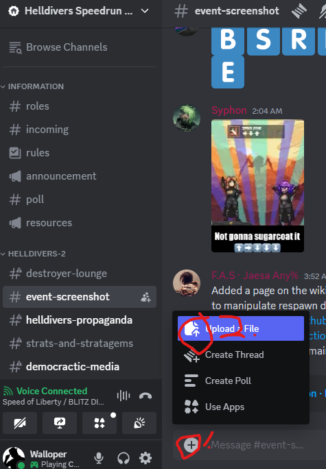
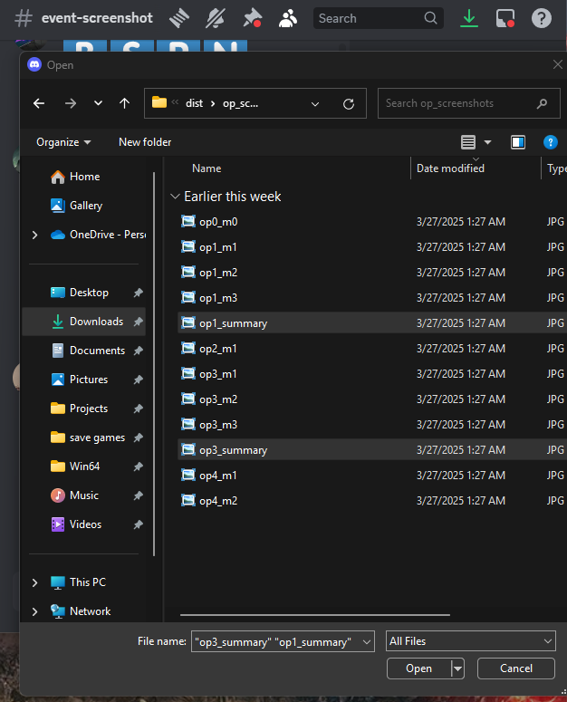

# Overview

BlitzLog is designed to help label your screenshots and track your time. You will still need to remember to take screenshots and upload them yourself... maybe a future version will do more :) 

## Screenshots

This app assumes you take Steam screenshots with f12... if you don't, either rebind or follow the advanced guide. Code is then easy to control+f and change f12 to what you want.

At any time, you can view your steam screenshots for helldivers 2 by clicking on the button with the Steam icon. Ditto your operation screenshots (white operation icon).

## Operation/Mission tracking

Press START to start. This also sets the timer.

Hit f12 to take screenshots of the end mission screens and operation summary. This will also update the log, organize your screenshot, and updates points.

If you fail a mission, click 'fail mission' or press f9. The op will be marked as failed, but still logged.

## How to read the Log

### Illustration 

* **Reload** refreshes settings and forcibly refreshes log (log refreshing _should_ never be necessary tho...).
* **Event**  describes what the row represents -- when you started, finished a mission/op, or suffered failure.
* Timings:
    + Elapsed: time passed from start
    + Split: time passed from last event
    + Local: time event occured in your timezone
    + UTC: time event occured in UTC iso timestamp

## Picking up where BlitzLog leaves off...

### Save your log

1. Copy log text
2. Paste into text file   

### Upload your screenshots

Upload your summary screenshots to HSC event-screenshot channel      