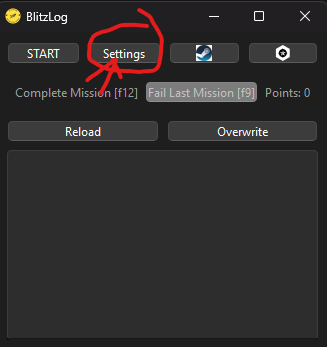
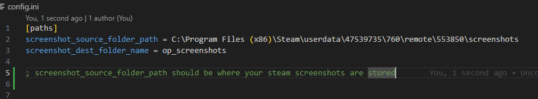
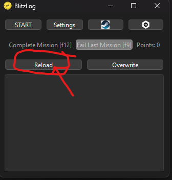
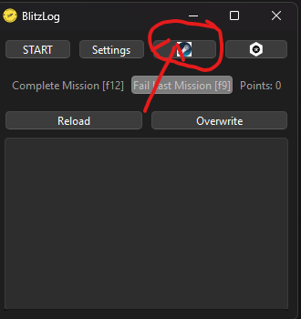
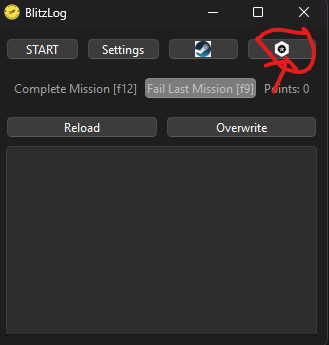

# Normal User

1. Download the zip for this project   
2. Extract zip   
3. Run the BlitzLog application         
4. Configure settings         
5. Confirm setup by using the app to open your Steam folder and Operations folder      
6. If that worked, CONGRATULATIONS! You're all set. Maybe check out the [Guide][1] for how to use the app...

[1]: <./guide.md>